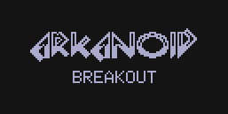
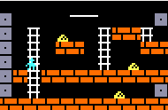
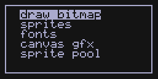
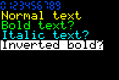

# LCDGFX library for display controllers

[](https://travis-ci.com/lexus2k/lcdgfx)
[](https://circleci.com/gh/lexus2k/lcdgfx)
[](https://coveralls.io/github/lexus2k/lcdgfx?branch=master)
[](https://codedocs.xyz/lexus2k/lcdgfx)


[tocstart]: # (toc start)

  * [Introduction](#introduction)
  * [Documentation](#documentation)
  * [Easy to use](#easy-to-use)
  * [Key Features](#key-features)
  * [Setting up](#setting-up)
  * [Supported displays](#supported-displays)
  * [Supported platforms](#supported-platforms)
  * [Projects using lcdgfx](#projects-using-lcdgfx)
  * [The goals of lcdgfx library](#the-goals-of-ldcgfx-library)
  * [License](#license)

[tocend]: # (toc end)


## Introduction

lcdgfx driver is C++ library with unicode support. The library can be compiled for plain Linux
(for example, raspberry spi), or you can use it with plain avr-gcc compiler without Arduino IDE. It supports
monochrome and RGB oleds and has debug mode, allowing to execute code on Linux, Windows and macOS, using SDL2.0.
The library is intended to run on small microcontrollers. It is developed to use as few resources as possible,
but still has powerful capabilities (NanoEngine), allowing to develop nice animation.
It works also on any powerful devices like raspberry pi, esp32; and can be easily ported to new platform.
This library integrates another library [canvas](https://github.com/lexus2k/canvas)

## Documentation

For more information about this library, please, visit https://github.com/lexus2k/lcdgfx.
Documentation generated by doxygen tool can be found at [codedocs xyz site](https://codedocs.xyz/lexus2k/lcdgfx).
The library provides numerous usage [examples](https://github.com/lexus2k/lcdgfx/tree/master/examples).

## Easy to use

Example:

```.cpp
DisplayST7735_128x160x16_SPI display(3,{-1, 4, 5, 0,-1,-1});

void setup()
{
    display.begin();
    display.clear();
}

void loop()
{
    display.setColor(RGB_COLOR16(255,255,0));
    display.drawLine(10,30,56,96);
}
```

## Key Features

 * Supports color, monochrome OLED displays
 * The library has modular structure, and some modules can be excluded from compilation at all to reduce flash usage.
 * **Very small footprint** ( Draw text example uses only 5KiB of Flash with I2C code, display code, font!!! and application itself.
   Examples without fonts start at 2.5KiB of Flash )
 * **Very small RAM consumption** ( Attiny85 with Damellis package needs minimum 30 bytes of RAM to communicate with OLED )
 * Fast implementation to provide reasonable speed on slow microcontrollers
 * Supports i2c and spi interfaces, allows to implement custom interfaces:
   * i2c (software implementation, Wire library, AVR Twi, Linux i2c-dev)
   * spi (4-wire spi via Arduino SPI library, AVR Spi, AVR USI module)
 * Primitive graphics functions (lines, rectangles, pixels, bitmaps, drawing canvas)
 * Printing text to display (using fonts of different size, [How to add new fonts](https://github.com/lexus2k/lcdgfx/wiki/How-to-create-new-font-for-the-library))
 * Includes [graphics engine](https://github.com/lexus2k/lcdgfx/wiki/Using-NanoEngine-for-systems-with-low-resources2) to support
   double buffering on tiny microcontrollers.
 * Can be used for game development (bonus examples):
   * Arkanoid game ([arkanoid](examples/games/arkanoid) in old style API and [arkanoid8](examples/games/arkanoid8) in new style API)
   * Simple [Lode runner](examples/games/lode_runner) game.
   * [Snowflakes](examples/nano_engine/snowflakes)







The i2c pins can be changed via API functions. Please, refer to documentation. Keep in mind,
that the pins, which are allowed for i2c or spi interface, depend on the hardware.
The default spi SCLK and MOSI pins are defined by SPI library, and DC, RST, CES pins are configurable
through API.

## Setting up

*i2c Hardware setup is described [here](https://github.com/lexus2k/lcdgfx/wiki/Hardware-setup)*

*Setting up for Arduino from github sources)*
 * Download source from https://github.com/lexus2k/lcdgfx
 * Put the sources to Arduino/libraries/lcdgfx folder

*Setting up for Arduino from Arduino IDE library manager*
 * Install lcdgfx library (named lcdgfx by Alexey Dynda) via Arduino IDE library manager

*Using with plain avr-gcc:*
 * Download source from https://github.com/lexus2k/lcdgfx
 * Build the library (variant 1)
   * cd lcdgfx/src && make -f Makefile.avr MCU=<your_mcu>
   * Link library to your project (refer to [Makefile.avr](examples/Makefile.avr) in examples folder).
 * Build demo code (variant 2)
   * cd lcdgfx/tools && ./build_and_run.sh -p avr -m <your_mcu> ssd1306_demo

 *For esp32:*
  * Download source from https://github.com/lexus2k/lcdgfx
  * Put downloaded sources to components/lcdgfx/ folder.
  * Compile your project as described in ESP-IDF build system documentation

For more information about this library, please, visit https://github.com/lexus2k/lcdgfx.
Doxygen documentation can be found at [Codedocs xyz site](https://codedocs.xyz/lexus2k/lcdgfx).
If you found any problem or have any idea, please, report to Issues section.

## Supported displays:

| **Display** | **I2C** | **SPI** | **Orientation** | **Comments** |
| :-------- |:---:|:---:|:---:|:---------|
| sh1106 128x64 | X | X |   |   |
| sh1107 128x64 | X | X |   |   |
| sh1107 64x128 | X | X |   |   |
| ssd1306 128x64 | X | X |   |   |
| ssd1306 128x32 | X | X |   |   |
| ssd1306 64x48 | X | X |   |   |
| ssd1306 64x32 | X | X |   |   |
| ssd1325 128x64 | X | X |   |   |
| ssd1327 128x128 | X | X |   |   |
| ssd1331 96x64 |   | X | X |   |
| ssd1351 128x128 |   | X | X |   |
| il9163 128x128 |   | X | X | please, don't forget to connect backlight |
| st7735 128x160 |   | X | X | please, don't forget to connect backlight |
| ili9341 240x320 |   | X | X | please, don't forget to connect backlight |
| pcd8544 84x48 |   | X  |   | Nokia 5110 |
| any other custom |  |  |  | Refer to [custom display example](examples/interfaces/custom_display/custom_display.ino) |

## Supported platforms

Compilers: gcc, clang

| **Platforms** | **I2C** | **SPI** | **Comments** |
| :-------- |:---:|:---:|:---------|
| **Arduino** |     |     |          |
| **Wio Terminal** |  X  |  X  | by SeeedStudio     |
| Attiny85, Attiny45  |  X  |  X  | Refer to [Damellis attiny package](https://raw.githubusercontent.com/damellis/attiny/ide-1.6.x-boards-manager/package_damellis_attiny_index.json) |
| Attiny84, Attiny44  |  X  |  X  | Refer to [Damellis attiny package](https://raw.githubusercontent.com/damellis/attiny/ide-1.6.x-boards-manager/package_damellis_attiny_index.json) |
| Atmega328p, Atmega168  |  X  |  X  |    |
| Atmega32u4  |  X  |  X  |    |
| Atmega2560  |  X  |  X  |    |
| Digispark, including PRO version  |  X  |  X  |  check [examples compatibility list](examples/Digispark_compatibility.txt)  |
| ESP8266  |  X  |  X  | check [examples compatibility list](examples/ESP8266_compatibility.txt)   |
| ESP32  |  X  |  X  | check [examples compatibility list](examples/ESP8266_compatibility.txt)   |
| STM32  |  X  |  X  | [stm32duino](https://github.com/stm32duino/wiki/wiki)  |
| Arduino Zero | X  | X  |    |
| Nordic nRF5 (nRF51, nRF52) | X | X | via Standard Arduino nRF52 boards. nRF users, enable c++11 in platform.txt `-std=gnu++11` |
| Nordic nRF5 (nRF51, nRF52) | X | X | via [Sandeep Mistry arduino-nRF5](https://github.com/sandeepmistry/arduino-nRF5) package |
| Wio Terminal |  X |  X  | [Wio Terminal](https://www.seeedstudio.com/Wio-Terminal-p-4509.html)  |
| **Plain AVR** |   |     |          |
| Attiny85, Attiny45 |  X  |  X  |         |
| Atmega328p, Atmega168 |  X  |  X  |         |
| Atmega32u4  |  X  |  X  |    |
| **Plain ESP32** |   |     |          |
| ESP32 |  X  | X  |  library can be used as IDF component  |
| **Plain ESP8266** |   |     |          |
| ESP8266 |  X  | X  |  library can be used as IDF RTOS component  |
| **Linux**  |    |     |          |
| Raspberry Pi |  X  |  X  | i2c-dev, spidev, sys/class/gpio  |
| [SDL Emulation](https://github.com/lexus2k/lcdgfx/wiki/How-to-run-emulator-mode) |  X  |  X  | demo code can be run without real OLED HW via SDL library |
| **macOS**  |    |     |          |
| [SDL Emulation](https://github.com/lexus2k/lcdgfx/wiki/How-to-run-emulator-mode) |  X  |  X  | demo code can be run without real OLED HW via SDL library |
| **Windows**  |    |     |          |
| [SDL Emulation](https://github.com/lexus2k/lcdgfx/wiki/How-to-run-emulator-mode) |  X  |  X  | demo code can be run without real OLED HW via MinGW32 + SDL library |

Digispark users, please check compilation options in your Arduino prior to using this library.
lcdgfx library requires at least c++11 and c99 (by default Digispark package misses the options
-std=gnu11, -std=gnu++11).

## Projects using lcdgfx

 * [GUIslice](https://github.com/ImpulseAdventure/GUIslice) - nice platform independent GUI library for embedded systems
 * [Tension Meter](https://www.hackster.io/tangielsky/tension-meter-for-saw-blades-on-band-saws-with-arduino-3d3298)
 * [ESP32-CAM with Capacitive Touch Buttons and OLED](https://robotzero.one/esp32-cam-oled-capacitive-touch-buttons)

## The goals of lcdgfx library

 * To use as few RAM as possible
 * To use as few Flash as possible
 * To be as fast as possible
 * To fit [Arkanoid game example](examples/games/arkanoid) to Attiny85 microcontroller

## License

The library is free. If this project helps you, you can give me a cup of coffee.

MIT License

Copyright (c) 2016-2020, Alexey Dynda

Permission is hereby granted, free of charge, to any person obtaining a copy
of this software and associated documentation files (the "Software"), to deal
in the Software without restriction, including without limitation the rights
to use, copy, modify, merge, publish, distribute, sublicense, and/or sell
copies of the Software, and to permit persons to whom the Software is
furnished to do so, subject to the following conditions:

The above copyright notice and this permission notice shall be included in all
copies or substantial portions of the Software.

THE SOFTWARE IS PROVIDED "AS IS", WITHOUT WARRANTY OF ANY KIND, EXPRESS OR
IMPLIED, INCLUDING BUT NOT LIMITED TO THE WARRANTIES OF MERCHANTABILITY,
FITNESS FOR A PARTICULAR PURPOSE AND NONINFRINGEMENT. IN NO EVENT SHALL THE
AUTHORS OR COPYRIGHT HOLDERS BE LIABLE FOR ANY CLAIM, DAMAGES OR OTHER
LIABILITY, WHETHER IN AN ACTION OF CONTRACT, TORT OR OTHERWISE, ARISING FROM,
OUT OF OR IN CONNECTION WITH THE SOFTWARE OR THE USE OR OTHER DEALINGS IN THE
SOFTWARE.
